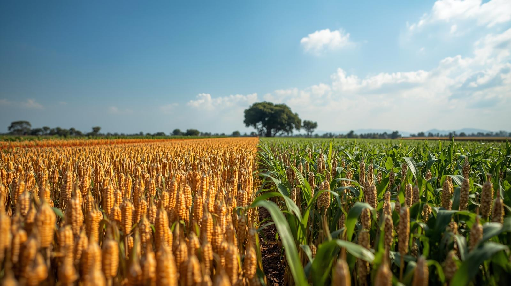

# Final-project
# **UGANDA KARAMOJA DISTRICT CROP YIELD, POPULATION AND AREA ANALYSIS**

## Members:
1. Ivy Muchangi
2. David Ndung'u
3. Steve Mburu
4. Winfred Mwangi
5. Marcus Kaula

## NOTE:

THE PROJECT WAS WHOLLY DONE BY THE GROUP MEMBERS. EVERYONE LISTED PARTICIPATED IN THE WORK EQUALLY. EVERY SECTION WAS DISCUSSED AS A GROUP WITH EACH MEMBER HAVING A PART IN IT.

## Overview

This notebook presents an exploratory data analysis of crop yield, population, and land area in the Karamoja District of Uganda. Agriculture is a critical sector in this region, and understanding the factors influencing crop production is essential for improving food security and livelihoods. This analysis focuses on key metrics such as sorghum and maize yields per hectare, cultivated land areas, and total production, alongside population data. The goal is to identify patterns, variations, and potential relationships between these variables across different districts within Karamoja.

## Problem Statement

The Karamoja sub-region in Uganda faces significant challenges related to food security, largely influenced by factors such as climate variability, land use, and agricultural practices. Stakeholders, including local government, NGOs, and agricultural organizations, need data-driven insights to develop effective strategies for improving crop yields and ensuring sustainable food production. Key questions that need to be addressed include:

1. How do crop yields (sorghum and maize) vary across the different districts in Karamoja?
   
2. Is there a discernible relationship between population size, land area, and crop production at the district level?
 
3. Which districts exhibit higher or lower agricultural productivity based on yield and area data?
 
4. What are the potential factors contributing to the observed variations in crop yields?
   
This project aims to analyze the provided dataset to shed light on these questions, providing a foundational understanding of the agricultural landscape in Karamoja to inform targeted interventions and planning for enhanced food security.

